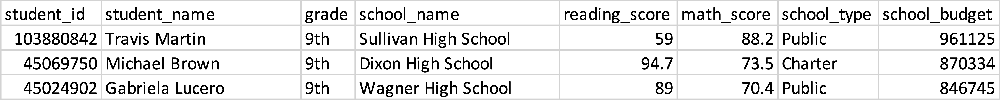
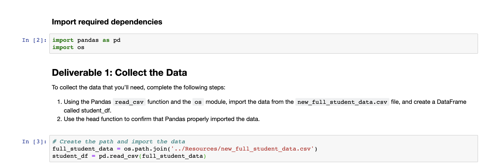

# PyCitySchools with Pandas

## Project Overview
---

Our client, the chief data scientist for a city school district, Maria, has requested our help in analyzing data on student funding and students' standardized test scores. Our primary task is to aggregate the data and showcase trends in the schools' performance.

 

### Purpose

The purpose of this analysis was to use the pandas library, alongside Python, to wrangle & analyze a dataset of the above mentioned areas, and to gather insights used to inform discussions & strategic decisions at the school and district level.

 

## Resources
---

* Data Source: *new_full_student_data.csv*
    

        
    
 

* Software: *Python 3.10.7, pandas 1.4.4, Jupyter Notebook 6.4.12*
    

        
    
 

 

## Findings & Summary
---

The analysis of the standardized scores and school budgets show that:

| Mean Reading Score | Mean Math Score | Mean School Budget |
|:----------------------:|:-------------------:|:----------------------:|
|         ~72.36         |        ~64.68       |        ~$893,743       |

 

The average school budget was higher for public schools than for charter schools
* Despite this, the mean reading score for both types of schools, across all 4 grades, was the same; and the mean math score of charter schools is slightly higher than that of public schools

 

In summary, what can be said about the students in these schools is that they seem to perform better in the reading section of the standardized tests than the math section. So, perhaps more attention should be devoted towards the students' mathematical comprehension. Another notable observation was that charter schools had slightly better standardized test results than public schools, despite the fact that public schools recieve *~$38,000* more in funding. It might be worthwhile to contrast and analyze a survey of students' impressions of their respective types of schools, to gain better insight into their practices.

We hope we were able to provide you with useful insights and a reliable platform to derive more of them.